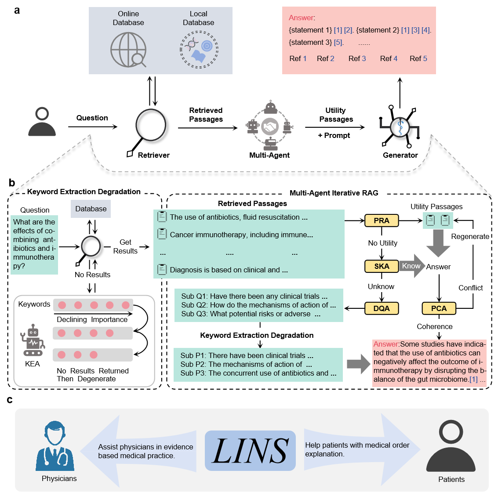

<h1> LINS: A Professional Medical Q&A Framework for Enhancing Knowledge Privacy and Timeliness</h1>

<div align="justify">
We developed LINS, a general medical Q&A framework that can seamlessly adapt to any medical field without additional training or fine-tuning. We introduced the Multi-Agent Iterative Retrieval Augmented Generation (MAIRAG) algorithm and the Keyword Extraction Degradation (KED) algorithm to help LINS generate Citation-Based Generative Text (CBGT). LINS achieved state-of-the-art (SOTA) performance in both subjective and objective evaluations on specialized medical datasets. Additionally, LINS supports keyword extraction, retrieval of the latest knowledge, and assists in evidence-based medical practice. It can also easily integrate with local knowledge bases without additional training or fine-tuning. In summary, LINS is a multifunctional, highly professional, privacy-protecting, and up-to-date medical Q&A framework with broad application value in the medical field. It is expected to promote the application and development of large language models in medicine, thereby improving the efficiency of related professionals. 
</div>

<br>



# Documentation 

LINS comes with different functionalities.

- [**Keyword Extraction**](#keyword-extraction)
- [**Retrieve Evidence**](#retrieve-evidence)
- [**Direct Multi-Round Q&A**](#direct-multi-round-qa)
- [**Original Retrieval-Augmented Generation**](#original-retrieval-augmented-generation)
- [**Multi-Agent Iterative Retrieval-Augmented Generation**](#multi-agent-iterative-retrieval-augmented-generation)
- [**Integrate Local Knowledge Base for Answering**](#integrate-local-knowledge-base-for-answering)

## Environmental Preparation

Clone this repo, and install python requirements.

```bash
conda create --name LINS python=3.11.6
conda activate LINS
pip install -r requirements.txt
conda install -c pytorch faiss-gpu
```

Install torch
```bash
pip install torch==2.1.0+cu118 torchvision torchaudio -f https://download.pytorch.org/whl/cu118/torch_stable.html
```

Install Nodejs.

```bash
apt install nodejs # If you use Ubuntu
```

Prepare SerpAPI Key

If you wants to use SerpAPI to get search results. You need to get a SerpAPI key from [here](https://serpapi.com/).

Then, set the environment variable `SERPAPI_KEY` to your key.

```bash
export SERPAPI_KEY="YOUR KEY"
```

## Model Preparation

The Qwen model can be found at [Qwen1.5-110B on Hugging Face](https://huggingface.co/Qwen/Qwen1.5-110B), the recall model for the retriever at [bge-m3 on Hugging Face](https://huggingface.co/BAAI/bge-m3), and the ranking model at [bge-reranker-v2-m3 on Hugging Face](https://huggingface.co/BAAI/bge-reranker-v2-m3). Finally, the T5 model (used for Link-Eval) is accessible at [t5-11b on Hugging Face](https://huggingface.co/google-t5/t5-11b).


These models are placed in the following positions：
```bash
├──model
│   ├──retriever
│   │   ├──bge
│   │   │   ├──bge-m3
│   │   │   ├──bge-reranker-v2-m3
│   ├──generator
│   │   ├──Qwen1.5-110B-Chat
│   ├──NLI
│   │   ├──T5-11B
```

# Functional implementation

## Keyword Extraction

```bash
from arguments import get_medlinker_args
from model.modeling_medlinker import load_model

args = get_medlinker_args()
args.medlinker_ckpt_path = "./model/generator/Qwen1.5-110B-Chat"

medlinker = load_model(args)

sentence = "As artificial intelligence (AI) rapidly approaches human-level performance in medical imaging, it is crucial that it does not exacerbate or propagate healthcare disparities. Previous research established AI’s capacity to infer demographic data from chest X-rays, leading to a key concern: do models using demographic shortcuts have unfair predictions across subpopulations? In this study, we conducted a thorough investigation into the extent to which medical AI uses demographic encodings, focusing on potential fairness discrepancies within both in-distribution training sets and external test sets. Our analysis covers three key medical imaging disciplines—radiology, dermatology and ophthalmology—and incorporates data from six global chest X-ray datasets. We confirm that medical imaging AI leverages demographic shortcuts in disease classification. Although correcting shortcuts algorithmically effectively addresses fairness gaps to create ‘locally optimal’ models within the original data distribution, this optimality is not true in new test settings. Surprisingly, we found that models with less encoding of demographic attributes are often most ‘globally optimal’, exhibiting better fairness during model evaluation in new test environments. Our work establishes best practices for medical imaging models that maintain their performance and fairness in deployments beyond their initial training contexts, underscoring critical considerations for AI clinical deployments across populations and sites."

max_num_keywords = 5  #There is no limit on the maximum number of keywords when max_num_keywords <= 0.

keywords = medlinker.keyword_extraction(sentence, max_num_keywords)

"""results
(ai) AND (medical imaging) AND (fairness) AND (demographic shortcuts) AND (disease classification)
"""
```

## Retrieve Evidence using KED


```bash
from arguments import get_medlinker_args
from model.modeling_medlinker import load_model

args = get_medlinker_args()
args.medlinker_ckpt_path = "./model/generator/Qwen1.5-110B-Chat"

medlinker = load_model(args)

sentence = "As artificial intelligence (AI) rapidly approaches human-level performance in medical imaging, it is crucial that it does not exacerbate or propagate healthcare disparities. Previous research established AI’s capacity to infer demographic data from chest X-rays, leading to a key concern: do models using demographic shortcuts have unfair predictions across subpopulations? In this study, we conducted a thorough investigation into the extent to which medical AI uses demographic encodings, focusing on potential fairness discrepancies within both in-distribution training sets and external test sets. Our analysis covers three key medical imaging disciplines—radiology, dermatology and ophthalmology—and incorporates data from six global chest X-ray datasets. We confirm that medical imaging AI leverages demographic shortcuts in disease classification. Although correcting shortcuts algorithmically effectively addresses fairness gaps to create ‘locally optimal’ models within the original data distribution, this optimality is not true in new test settings. Surprisingly, we found that models with less encoding of demographic attributes are often most ‘globally optimal’, exhibiting better fairness during model evaluation in new test environments. Our work establishes best practices for medical imaging models that maintain their performance and fairness in deployments beyond their initial training contexts, underscoring critical considerations for AI clinical deployments across populations and sites."

max_num_keywords = -1  #There is no limit on the maximum number of keywords when max_num_keywords <= 0.

evidence = medlinker.keyword_search(sentence, if_short_sentences=False)

""" results
'url': 'https://pubmed.ncbi.nlm.nih.gov/38942996'

'title': 'The limits of fair medical imaging AI in real-world generalization.'

'text': "As artificial intelligence (AI) rapidly approaches human-level performance in medical imaging, it is crucial that it does not exacerbate or propagate healthcare disparities. Previous research established AI's capacity to infer demographic data from chest X-rays, leading to a key concern: do models using demographic shortcuts have unfair predictions across subpopulations? In this study, we conducted a thorough investigation into the extent to which medical AI uses demographic encodings, focusing on potential fairness discrepancies within both in-distribution training sets and external test sets. Our analysis covers three key medical imaging disciplines-radiology, dermatology and ophthalmology-and incorporates data from six global chest X-ray datasets. We confirm that medical imaging AI leverages demographic shortcuts in disease classification. Although correcting shortcuts algorithmically effectively addresses fairness gaps to create 'locally optimal' models within the original data distribution, this optimality is not true in new test settings. Surprisingly, we found that models with less encoding of demographic attributes are often most 'globally optimal', exhibiting better fairness during model evaluation in new test environments. Our work establishes best practices for medical imaging models that maintain their performance and fairness in deployments beyond their initial training contexts, underscoring critical considerations for AI clinical deployments across populations and sites."
"""
```

## Direct Multi-Round Q&A

```bash
from arguments import get_medlinker_args
from model.modeling_medlinker import load_model

args = get_medlinker_args()
args.medlinker_ckpt_path = "./model/generator/Qwen1.5-110B-Chat"

medlinker = load_model(args)

response, history = medlinker.chat(prompt="hello", history=None)

"""response
'Hello there! How can I assist you today?'
"""

response, history = medlinker.chat(prompt="do models using demographic shortcuts have unfair predictions across subpopulations?", history=history)

"""response
Models that use demographic shortcuts, or proxies for sensitive attributes like age, gender, race, etc., can indeed lead to unfair predictions across subpopulations. This happens because relying on demographic characteristics can inadvertently bake in societal biases and historical inequalities into the model's decision-making process. When a model uses such shortcuts, it may:\n\n1. **Sterotyping**: It may make assumptions based on group characteristics rather than individual qualities or circumstances, leading to unfair treatment of certain groups. For example, assuming that all individuals from a particular demographic have lower creditworthiness without considering their personal financial history.\n\n2. **Disparate Impact**: Certain subpopulations might be disproportionately affected by the model's decisions. If a model uses a demographic feature that is not directly related to the outcome but is correlated with it due to societal factors, it can lead to unequal outcomes. For instance, using zip codes as a proxy for credit risk could inadvertently discriminate against certain ethnic groups if those areas have historically been subject to redlining.\n\n3. **Oversimplification**: Demographic variables can oversimplify complex social dynamics, neglecting other important factors that might contribute to different outcomes within those groups.\n\nTo mitigate these issues, developers of predictive models often employ techniques such as:\n\n- **Fairness-aware machine learning**: This involves adjusting algorithms to ensure they treat all groups fairly according to specific fairness definitions (e.g., demographic parity, equalized odds).\n  \n- **Feature selection**: Careful consideration is given to which features to include, avoiding those that could lead to unfair biases.\n  \n- **Blinding**: Removing sensitive attributes from the training data to prevent the model from directly learning from them.\n  \n- **Adaptive or contextual models**: These models might consider additional context or use more nuanced approaches to capture individual circumstances rather than relying on broad demographic categories.\n\nIt's important to note that achieving fairness in machine learning is a complex task, often involving trade-offs between different fairness definitions and accuracy. Context and the specific application domain play a crucial role in determining what constitutes a fair model.
"""
```


## Original Retrieval-Augmented Generation

```bash
from arguments import get_medlinker_args
from model.modeling_medlinker import load_model

args = get_medlinker_args()
args.medlinker_ckpt_path = "./model/generator/Qwen1.5-110B-Chat"

medlinker = load_model(args)

question = "What are the effects of combining antibiotics and immunotherapy?"
results = medlinker.Original_RAG(question)

"""results
answer: Combining antibiotics and immunotherapy has not been specifically detailed in the provided knowledge regarding gastric MALT lymphoma. However, H. pylori eradication, typically achieved with antibiotics, is the first-line treatment leading to high remission rates, while immunotherapy like rituximab is reserved for non-responding cases. The synergistic effects or specific combinations in the context of MALT lymphoma treatment are not mentioned. In general, antibiotic therapy targets the bacterial infection, whereas immunotherapy aims to enhance or restore the patient's immune response to cancer cells. Further research would be necessary to discuss the combined effects in detail.[1]

refs: [1] https://pubmed.ncbi.nlm.nih.gov/24363507
"""
```

## Multi-Agent Iterative Retrieval-Augmented Generation

```bash
from arguments import get_medlinker_args
from model.modeling_medlinker import load_model

args = get_medlinker_args()
args.medlinker_ckpt_path = "./model/generator/Qwen1.5-110B-Chat"

medlinker = load_model(args)

question = "What are the effects of combining antibiotics and immunotherapy?"
results = medlinker.MAIRAG(question)

"""results
answer: Combining antibiotics with immunotherapy has demonstrated enhanced treatment efficacy against bacterial infections, particularly in combating drug-resistant pathogens. For instance, the coadministration of Clofazimine (CFZ) and Rapamycin (RAPA) effectively eliminates both multiple and extensively drug-resistant (MDR and XDR) strains of Mycobacterium tuberculosis in a mouse model by boosting T-cell memory and polyfunctional TCM responses, while also reducing latency-associated gene expression in human macrophages [2]. This approach not only improves bacterial clearance but also holds promise for addressing the issue of drug resistance and disease recurrence in tuberculosis. Similarly, N-formylated peptides have shown adjunctive therapeutic effects when combined with anti-tuberculosis drugs (ATDs), conferring additional therapeutic benefits in mouse models of TB by enhancing neutrophil function and reducing bacterial load [3]. These findings highlight the potential of combining antimicrobial and immunomodulatory agents to achieve improved outcomes in bacterial infection treatment.

refs: [1] https://pubmed.ncbi.nlm.nih.gov/37481650
      [2] https://pubmed.ncbi.nlm.nih.gov/37290049
      [3] https://pubmed.ncbi.nlm.nih.gov/31046503
      [4] https://pubmed.ncbi.nlm.nih.gov/33552074
      [5] https://pubmed.ncbi.nlm.nih.gov/11244046
"""
```

## Integrate Local Knowledge Base for Answering


Assume you have a local knowledge base that you want to connect to LINS for RAG (using OncoKB as an example). Ensure you have prepared the local knowledge base JSON file in the add_dataset folder as shown below (the format can refer to oncokb.json).

```bash
├── add_database.py
├── __init__.py
└── oncokb
    └── oncokb.json
```

Follow the steps below to get the local vector knowledge base.
```bash
pip install FlagEmbedding
cd add_dataset
python add_database.py oncokb
```
Then you get the vector knowledge base at the end of embedding.json

```bash
├── add_database.py
├── __init__.py
└── oncokb
    └── oncokb.json
    └── oncokb_embedding.json
```
The above operations only need to be performed the first time a new knowledge base is accessed, and subsequently LINS can be invoked to retrieve the local knowledge base for RAG.

```bash
from arguments import get_medlinker_args
from model.modeling_medlinker import load_model

args = get_medlinker_args()
args.medlinker_ckpt_path = "./model/generator/Qwen1.5-110B-Chat"

medlinker = load_model(args)

question = "What medications should be used to treat breast cancer?"

#(sub_question_answer, sub_urls, sub_texts) = medlinker.Original_RAG(question=question, loacal_data_name='oncokb', if_pubmed=False)
(sub_question_answer, sub_urls, sub_texts) = medlinker.MAIRAG(question=question, loacal_data_name='oncokb', if_pubmed=False)

"""results
The treatment for breast cancer varies depending on the specific genetic alterations present in the tumor. If there is an amplification at the ERBB2 gene, several treatment options are recommended. These include:\n\n1. Chemotherapy combined with Pertuzumab and Trastuzumab [1].\n2. Chemotherapy with Trastuzumab, either alone or in combination [2].\n3. Tucatinib, Capecitabine, and Trastuzumab as a therapeutic regimen [3].\n4. Alternatively, for cases with ERBB2 amplification, Lapatinib with Letrozole or in combination with Capecitabine can also be considered [5].\n\nFor patients with a specific mutation (H1047R) in the PIK3CA gene, the recommended medications expand to include LOXO-783 in various combinations, such as with Fulvestrant, LY3484356, Abemaciclib, Paclitaxel, or Aromatase Inhibition Therapy [4].\n\nIt's important to note that these recommendations are tailored to specific genetic profiles and should be prescribed by an oncologist based on comprehensive analysis and clinical judgment.

refs: 'https://www.oncokb.org/entry/1873'
      'https://www.oncokb.org/entry/5556'
      'https://www.oncokb.org/entry/4709'
      'https://www.oncokb.org/entry/4697'
      'https://www.oncokb.org/entry/7735'
      'https://www.oncokb.org/entry/4697'
      'https://www.oncokb.org/entry/3910'
      'https://www.oncokb.org/entry/2371'
      'https://www.oncokb.org/entry/287'
      'https://www.oncokb.org/entry/6001'
"""
```

## Link-Eval Computation


