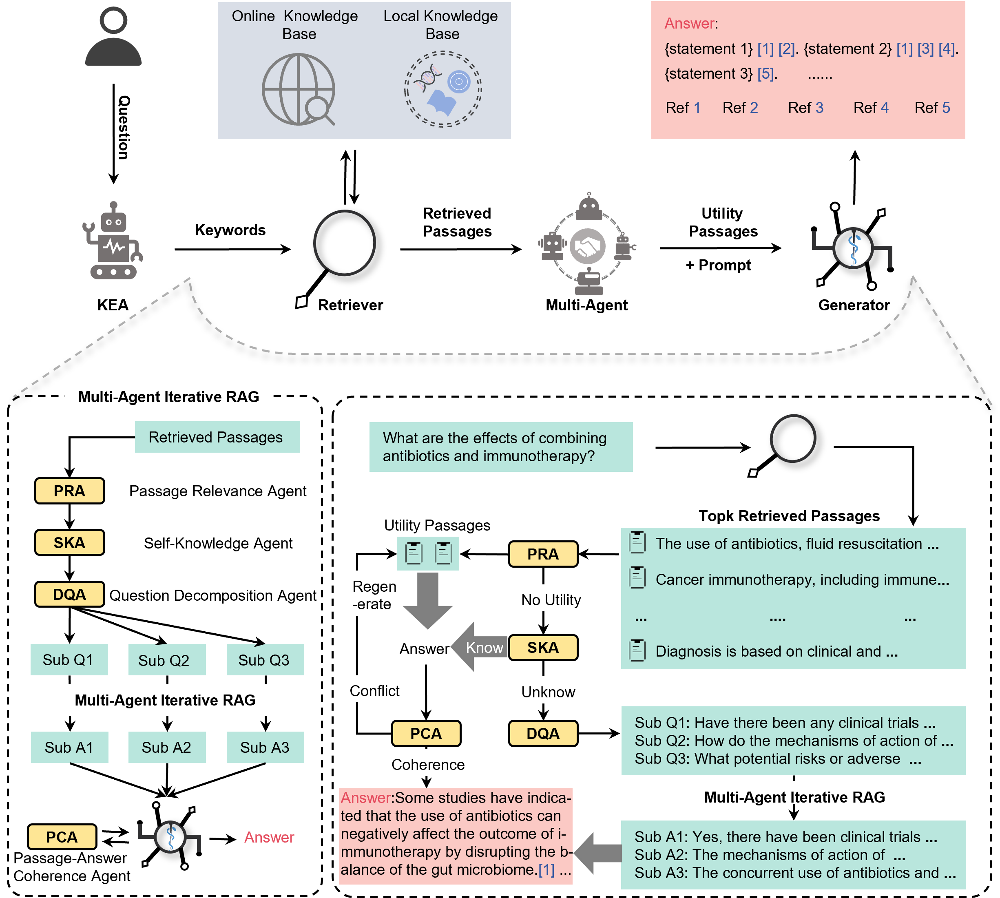

# LINS：增强知识隐私和时效性的专业医疗问答框架

我们开发了LINS，一种通用的医疗问答框架，可无缝适应任何医疗领域，无需额外培训或微调。我们首次提出了多智能体迭代检索增强算法（MAIRAG）和关键词提取退化算法（KED），帮助LINS生成带引用生成式文本（CBGT）。LINS在专业医学数据集上的主客观评测都达到了最优性能（SOTA）。此外，LINS支持关键词提取、最新知识检索、辅助医学循证实践，并且可以轻松接入本地知识库无需额外的训练和微调。总之，LINS作为一个专业性强、隐私保护性好、知识时效性强的多功能通用医学问答框架，在医学领域有着广泛的应用价值，有望推动大语言模型在医学中的应用和发展，从而提高相关专业人员的效率。

_Read this in [English](README.md)._
