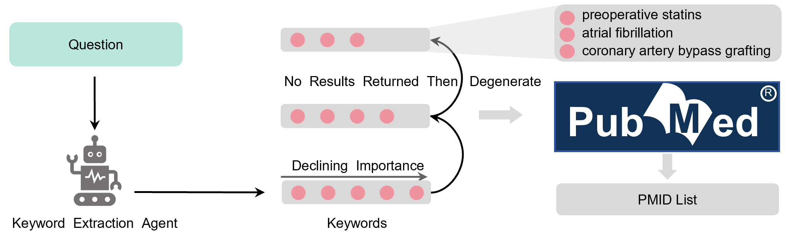
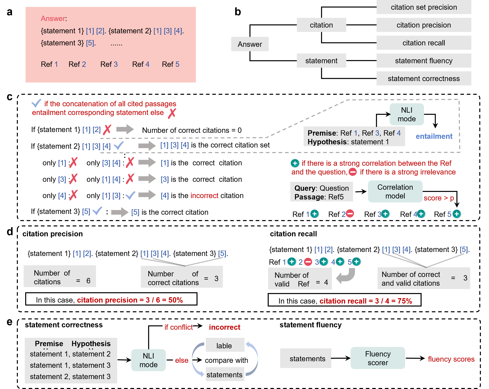

# 灵枢: 一个增强知识隐私和及时性的专业医疗问答框架

<div align="justify">
我们开发了灵枢（LINS），这是一个通用的医疗问答框架，可以无缝适应任何医疗领域而无需额外的训练或微调。我们引入了多智能体迭代检索增强生成（MAIRAG）算法和关键词提取退化（KED）算法，帮助灵枢生成带引用生成式文本（CBGT）。灵枢在专业医疗数据集的主观和客观评估中都达到了最先进的（SOTA）性能。此外，灵枢支持关键词提取、最新知识检索，并有助于循证医学实践。它还可以轻松与本地知识库集成，而无需额外的训练或微调。总之，灵枢是一个多功能、高度专业、保护隐私且及时更新的医疗问答框架，在医疗领域具有广泛的应用价值。预计它将促进大语言模型在医学中的应用和发展，从而提高相关专业人士的工作效率。
</div>

<br>


# 文档

灵枢 具有不同的功能。

- [**关键词提取**](#keyword-extraction)
- [**检索证据**](#retrieve-evidence)
- [**直接多轮问答**](#direct-multi-round-qa)
- [**原始检索增强生成**](#original-retrieval-augmented-generation)
- [**多智能体迭代检索增强生成**](#multi-agent-iterative-retrieval-augmented-generation)
- [**集成本地知识库回答**](#integrate-local-knowledge-base-for-answering)
- [**Link-Eval计算**](#link-eval-computation)

## 环境准备

克隆此仓库，并安装 Python 依赖项。

```bash
conda create --name LINS python=3.11.6
conda activate LINS
pip install -r requirements.txt
conda install -c pytorch faiss-gpu
```

安装 torch
```bash
pip install torch==2.1.0+cu118 torchvision torchaudio -f https://download.pytorch.org/whl/cu118/torch_stable.html
```

安装 Nodejs。

```bash
apt install nodejs # 如果你使用 Ubuntu
```

准备 SerpAPI 密钥

如果你想使用 SerpAPI 获取搜索结果。你需要从 [这里](https://serpapi.com/) 获取一个 SerpAPI 密钥。

然后，将环境变量 `SERPAPI_KEY` 设置为你的密钥。

```bash
export SERPAPI_KEY="YOUR KEY"
```

## 模型准备

可以在 [Hugging Face 上的 Qwen1.5-110B](https://huggingface.co/Qwen/Qwen1.5-110B) 找到 Qwen 模型，检索模型在 [Hugging Face 上的 bge-m3](https://huggingface.co/BAAI/bge-m3)，排序模型在 [Hugging Face 上的 bge-reranker-v2-m3](https://huggingface.co/BAAI/bge-reranker-v2-m3)，最后，T5 模型（用于 Link-Eval）可以在 [Hugging Face 上的 t5-11b](https://huggingface.co/google-t5/t5-11b) 获取。

这些模型放置在以下位置：
```bash
├──model
│   ├──retriever
│   │   ├──bge
│   │   │   ├──bge-m3
│   │   │   ├──bge-reranker-v2-m3
│   ├──generator
│   │   ├──Qwen1.5-110B-Chat
│   ├──NLI
│   │   ├──T5-11B
```

# 功能实现

## 关键词提取

```bash
from arguments import get_medlinker_args
from model.modeling_medlinker import load_model

args = get_medlinker_args()
args.medlinker_ckpt_path = "./model/generator/Qwen1.5-110B-Chat"

medlinker = load_model(args)

sentence = "As artificial intelligence (AI) rapidly approaches human-level performance in medical imaging, it is crucial that it does not exacerbate or propagate healthcare disparities. Previous research established AI’s capacity to infer demographic data from chest X-rays, leading to a key concern: do models using demographic shortcuts have unfair predictions across subpopulations? In this study, we conducted a thorough investigation into the extent to which medical AI uses demographic encodings, focusing on potential fairness discrepancies within both in-distribution training sets and external test sets. Our analysis covers three key medical imaging disciplines—radiology, dermatology and ophthalmology—and incorporates data from six global chest X-ray datasets. We confirm that medical imaging AI leverages demographic shortcuts in disease classification. Although correcting shortcuts algorithmically effectively addresses fairness gaps to create ‘locally optimal’ models within the original data distribution, this optimality is not true in new test settings. Surprisingly, we found that models with less encoding of demographic attributes are often most ‘globally optimal’, exhibiting better fairness during model evaluation in new test environments. Our work establishes best practices for medical imaging models that maintain their performance and fairness in deployments beyond their initial training contexts, underscoring critical considerations for AI clinical deployments across populations and sites."

max_num_keywords = 5  #当 max_num_keywords <= 0 时，没有关键词数量的最大限制。

keywords = medlinker.keyword_extraction(sentence, max_num_keywords)

"""results
(ai) AND (medical imaging) AND (fairness) AND (demographic shortcuts) AND (disease classification)
"""
```

## 使用 KED 检索证据



```bash
from arguments import get_medlinker_args
from model.modeling_medlinker import load_model

args = get_medlinker_args()
args.medlinker_ckpt_path = "./model/generator/Qwen1.5-110B-Chat"

medlinker = load_model(args)

sentence = "As artificial intelligence (AI) rapidly approaches human-level performance in medical imaging, it is crucial that it does not exacerbate or propagate healthcare disparities. Previous research established AI’s capacity to infer demographic data from chest X-rays, leading to a key concern: do models using demographic shortcuts have unfair predictions across subpopulations? In this study, we conducted a thorough investigation into the extent to which medical AI uses demographic encodings, focusing on potential fairness discrepancies within both in-distribution training sets and external test sets. Our analysis covers three key medical imaging disciplines—radiology, dermatology and ophthalmology—and incorporates data from six global chest X-ray datasets. We confirm that medical imaging AI leverages demographic shortcuts in disease classification. Although correcting shortcuts algorithmically effectively addresses fairness gaps to create ‘locally optimal’ models within the original data distribution, this optimality is not true in new test settings. Surprisingly, we found that models with less encoding of demographic attributes are often most ‘globally optimal’, exhibiting better fairness during model evaluation in new test environments. Our work establishes best practices for medical imaging models that maintain their performance and fairness in deployments beyond their initial training contexts, underscoring critical considerations for AI clinical deployments across populations and sites."

max_num_keywords = -1  #当 max_num_keywords <= 0 时，没有关键词数量的最大限制。

evidence = medlinker.keyword_search(sentence, if_short_sentences=False)

""" results
'url': 'https://pubmed.ncbi.nlm.nih.gov/38942996'

'title': 'The limits of fair medical imaging AI in real-world generalization.'

'text': "As artificial intelligence (AI) rapidly approaches human-level performance in medical imaging, it is crucial that it does not exacerbate or propagate healthcare disparities. Previous research established AI's capacity to infer demographic data from chest X-rays, leading to a key concern: do models using demographic shortcuts have unfair predictions across subpopulations? In this study, we conducted a thorough investigation into the extent to which medical AI uses demographic encodings, focusing on potential fairness discrepancies within both in-distribution training sets and external test sets. Our analysis covers three key medical imaging disciplines-radiology, dermatology and ophthalmology-and incorporates data from six global chest X-ray datasets. We confirm that medical imaging AI leverages demographic shortcuts in disease classification. Although correcting shortcuts algorithmically effectively addresses fairness gaps to create 'locally optimal' models within the original data distribution, this optimality is not true in new test settings. Surprisingly, we found that models with less encoding of demographic attributes are often most 'globally optimal', exhibiting better fairness during model evaluation in new test environments. Our work establishes best practices for medical imaging models that maintain their performance and fairness in deployments beyond their initial training contexts, underscoring critical considerations for AI clinical deployments across populations and sites."
"""
```

## 直接多轮问答

```bash
from arguments import get_medlinker_args
from model.modeling_medlinker import load_model

args = get_medlinker_args()
args.medlinker_ckpt_path = "./model/generator/Qwen1.5-110B-Chat"

medlinker = load_model(args)

response, history = medlinker.chat(prompt="hello", history=None)

"""response
'Hello there! How can I assist you today?'
"""

response, history = medlinker.chat(prompt="do models using demographic shortcuts have unfair predictions across subpopulations?", history=history)

"""response
Models that use demographic shortcuts, or proxies for sensitive attributes

 like age, gender, race, etc., can indeed lead to unfair predictions across subpopulations. This happens because relying on demographic characteristics can inadvertently bake in societal biases and historical inequalities into the model's decision-making process. When a model uses such shortcuts, it may:\n\n1. **Sterotyping**: It may make assumptions based on group characteristics rather than individual qualities or circumstances, leading to unfair treatment of certain groups. For example, assuming that all individuals from a particular demographic have lower creditworthiness without considering their personal financial history.\n\n2. **Disparate Impact**: Certain subpopulations might be disproportionately affected by the model's decisions. If a model uses a demographic feature that is not directly related to the outcome but is correlated with it due to societal factors, it can lead to unequal outcomes. For instance, using zip codes as a proxy for credit risk could inadvertently discriminate against certain ethnic groups if those areas have historically been subject to redlining.\n\n3. **Oversimplification**: Demographic variables can oversimplify complex social dynamics, neglecting other important factors that might contribute to different outcomes within those groups.\n\nTo mitigate these issues, developers of predictive models often employ techniques such as:\n\n- **Fairness-aware machine learning**: This involves adjusting algorithms to ensure they treat all groups fairly according to specific fairness definitions (e.g., demographic parity, equalized odds).\n  \n- **Feature selection**: Careful consideration is given to which features to include, avoiding those that could lead to unfair biases.\n  \n- **Blinding**: Removing sensitive attributes from the training data to prevent the model from directly learning from them.\n  \n- **Adaptive or contextual models**: These models might consider additional context or use more nuanced approaches to capture individual circumstances rather than relying on broad demographic categories.\n\nIt's important to note that achieving fairness in machine learning is a complex task, often involving trade-offs between different fairness definitions and accuracy. Context and the specific application domain play a crucial role in determining what constitutes a fair model.
"""
```


## 原始检索增强生成

```bash
from arguments import get_medlinker_args
from model.modeling_medlinker import load_model

args = get_medlinker_args()
args.medlinker_ckpt_path = "./model/generator/Qwen1.5-110B-Chat"

medlinker = load_model(args)

question = "What are the effects of combining antibiotics and immunotherapy?"
results = medlinker.Original_RAG(question)

"""results
answer: Combining antibiotics and immunotherapy has not been specifically detailed in the provided knowledge regarding gastric MALT lymphoma. However, H. pylori eradication, typically achieved with antibiotics, is the first-line treatment leading to high remission rates, while immunotherapy like rituximab is reserved for non-responding cases. The synergistic effects or specific combinations in the context of MALT lymphoma treatment are not mentioned. In general, antibiotic therapy targets the bacterial infection, whereas immunotherapy aims to enhance or restore the patient's immune response to cancer cells. Further research would be necessary to discuss the combined effects in detail.[1]

refs: [1] https://pubmed.ncbi.nlm.nih.gov/24363507
"""
```

## 多智能体迭代检索增强生成

```bash
from arguments import get_medlinker_args
from model.modeling_medlinker import load_model

args = get_medlinker_args()
args.medlinker_ckpt_path = "./model/generator/Qwen1.5-110B-Chat"

medlinker = load_model(args)

question = "What are the effects of combining antibiotics and immunotherapy?"
response, urls, retrieved_passages, history = medlinker.MAIRAG(question)
#response, urls, retrieved_passages, history = medlinker.MAIRAG(question, history = history)#continue chat

"""results
answer: Combining antibiotics with immunotherapy has demonstrated enhanced treatment efficacy against bacterial infections, particularly in combating drug-resistant pathogens. For instance, the coadministration of Clofazimine (CFZ) and Rapamycin (RAPA) effectively eliminates both multiple and extensively drug-resistant (MDR and XDR) strains of Mycobacterium tuberculosis in a mouse model by boosting T-cell memory and polyfunctional TCM responses, while also reducing latency-associated gene expression in human macrophages [2]. This approach not only improves bacterial clearance but also holds promise for addressing the issue of drug resistance and disease recurrence in tuberculosis. Similarly, N-formylated peptides have shown adjunctive therapeutic effects when combined with anti-tuberculosis drugs (ATDs), conferring additional therapeutic benefits in mouse models of TB by enhancing neutrophil function and reducing bacterial load [3]. These findings highlight the potential of combining antimicrobial and immunomodulatory agents to achieve improved outcomes in bacterial infection treatment.

refs: [1] https://pubmed.ncbi.nlm.nih.gov/37481650
      [2] https://pubmed.ncbi.nlm.nih.gov/37290049
      [3] https://pubmed.ncbi.nlm.nih.gov/31046503
      [4] https://pubmed.ncbi.nlm.nih.gov/33552074
      [5] https://pubmed.ncbi.nlm.nih.gov/11244046
"""
```

## 集成本地知识库回答


假设你有一个本地知识库，想将其连接到灵枢进行RAG（以OncoKB为例）。确保你已准备好如下所示的add_dataset文件夹中的本地知识库JSON文件（格式可以参考oncokb.json）。

```bash
├── add_database.py
├── __init__.py
└── oncokb
    └── oncokb.json
```

按照以下步骤获取本地向量知识库。
```bash
pip install FlagEmbedding
cd add_dataset
python add_database.py oncokb
```
然后你会在 embedding.json 结尾处获得向量知识库

```bash
├── add_database.py
├── __init__.py
└── oncokb
    └── oncokb.json
    └── oncokb_embedding.json
```
上述操作仅在首次访问新知识库时执行，随后灵枢可以调用检索本地知识库进行RAG。

```bash
from arguments import get_medlinker_args
from model.modeling_medlinker import load_model

args = get_medlinker_args()
args.medlinker_ckpt_path = "./model/generator/Qwen1.5-110B-Chat"

medlinker = load_model(args)

question = "What medications should be used to treat breast cancer?"

#(sub_question_answer, sub_urls, sub_texts) = medlinker.Original_RAG(question=question, loacal_data_name='oncokb', if_pubmed=False)
(sub_question_answer, sub_urls, sub_texts) = medlinker.MAIRAG(question=question, loacal_data_name='oncokb', if_pubmed=False)

"""results
The treatment for breast cancer varies depending on the specific genetic alterations present in the tumor. If there is an amplification at the ERBB2 gene, several treatment options are recommended. These include:\n\n1. Chemotherapy combined with Pertuzumab and Trastuzumab [1].\n2. Chemotherapy with Trastuzumab, either alone or in combination [2].\n3. Tucatinib, Capecitabine, and Trastuzumab as a therapeutic regimen [3].\n4. Alternatively, for cases with ERBB2 amplification, Lapatinib with Letrozole or in combination with Capecitabine can also be considered [5].\n\nFor patients with a specific mutation (H1047R) in the PIK3CA gene, the recommended medications expand to include LOXO-783 in various combinations, such as with Fulvestrant, LY3484356, Abemaciclib, Paclitaxel, or Aromatase Inhibition Therapy [4].\n\nIt's important to note that these recommendations are tailored to specific genetic profiles and should be prescribed by an oncologist based on comprehensive analysis and clinical judgment.

refs: 'https://www.oncokb.org/entry/1873'
      'https://www.oncokb.org/entry/5556'
      'https://www.oncokb.org/entry/4709'
      'https://www.oncokb.org/entry/4697'
      'https://www.oncokb.org/entry/7735'
      'https://www.oncokb.org/entry/4697'
      'https://www.oncokb.org/entry/3910'
      'https://www.oncokb.org/entry/2371'
      'https://www.oncokb.org/entry/287'
      'https://www.oncokb.org/entry/6001'
"""
```

## 链接评估计算


如果你想使用Link-Eval评估基于引用的生成文本（CBGT）的质量，请按照以下步骤设置环境并封装数据。

首先，设置环境：
```bash
pip install prettytable
pip install sentencepiece
```
接下来，从 [unieval-sum](https://huggingface.co/MingZhong/unieval-sum) 下载模型并将其存储在以下目录中：
```bash
├──model
│   ├──retriever
│   ├──generator
│   ├──NLI
│   ├──UniEval
│   │   ├──unieval-sum
```
最后，使用

以下代码计算Link-Eval分数：
```bash
from Link_Eval import LinkEval, convert_to_statements

linkeval = LinkEval(NLI_path="./model/MLI/T5-11B", unieval_path="./model/UniEval/unieval-sum")

question = "What are the effects of combining antibiotics and immunotherapy?"

answer = "Combining antibiotics with immunotherapy has demonstrated enhanced treatment efficacy against bacterial infections, particularly in combating drug-resistant pathogens. For instance, the coadministration of Clofazimine (CFZ) and Rapamycin (RAPA) effectively eliminates both multiple and extensively drug-resistant (MDR and XDR) strains of Mycobacterium tuberculosis in a mouse model by boosting T-cell memory and polyfunctional TCM responses, while also reducing latency-associated gene expression in human macrophages [2]. This approach not only improves bacterial clearance but also holds promise for addressing the issue of drug resistance and disease recurrence in tuberculosis. Similarly, N-formylated peptides have shown adjunctive therapeutic effects when combined with anti-tuberculosis drugs (ATDs), conferring additional therapeutic benefits in mouse models of TB by enhancing neutrophil function and reducing bacterial load [3]. These findings highlight the potential of combining antimicrobial and immunomodulatory agents to achieve improved outcomes in bacterial infection treatment."

refs = ["The advent of drug-resistant pathogens results in the occurrence of stubborn bacterial infections that cannot be treated with traditional antibiotics. Antibacterial immunotherapy by reviving or activating the body's immune system to eliminate pathogenic bacteria has confirmed promising therapeutic strategies in controlling bacterial infections. Subsequent studies found that antimicrobial immunotherapy has its own benefits and limitations, such as avoiding recurrence of infection and autoimmunity-induced side effects. Current studies indicate that the various antibacterial therapeutic strategies inducing immune regulation can achieve superior therapeutic efficacy compared with monotherapy alone. Therefore, summarizing the recent advances in nanomedicine with immunomodulatory functions for combating bacterial infections is necessary. Herein, we briefly introduce the crisis caused by drug-resistant bacteria and the opportunity for antibacterial immunotherapy. Then, immune-involved multimodal antibacterial therapy for the treatment of infectious diseases was systematically summarized. Finally, the prospects and challenges of immune-involved combinational therapy are discussed.", "Mycobacterium tuberculosis, the causative agent of tuberculosis, is acquiring drug resistance at a faster rate than the discovery of new antibiotics. Therefore, alternate therapies that can limit the drug resistance and disease recurrence are urgently needed. Emerging evidence indicates that combined treatment with antibiotics and an immunomodulator provides superior treatment efficacy. Clofazimine (CFZ) enhances the generation of T central memory (TCM) cells by blocking the Kv1.3+ potassium channels. Rapamycin (RAPA) facilitates M. tuberculosis clearance by inducing autophagy. In this study, we observed that cotreatment with CFZ and RAPA potently eliminates both multiple and extensively drug-resistant (MDR and XDR) clinical isolates of M. tuberculosis in a mouse model by inducing robust T-cell memory and polyfunctional TCM responses. Furthermore, cotreatment reduces the expression of latency-associated genes of M. tuberculosis in human macrophages. Therefore, CFZ and RAPA cotherapy holds promise for treating patients infected with MDR and XDR strains of M. tuberculosis.", "Objective: The current therapeutic regimens for tuberculosis (TB) are complex and involve the prolonged use of multiple antibiotics with diverse side effects that lead to therapeutic failure and bacterial resistance. The standard appliance of immunotherapy may aid as a powerful tool to combat the ensuing threat of TB. We have earlier reported the immunotherapeutic potential of N-formylated peptides of two secretory proteins of Mycobacterium tuberculosis H37Rv. Here, we investigated the immunotherapeutic effect of an N-formylated peptide from Listeria monocytogenes in experimental TB. Methods: The N-terminally formylated listerial peptide with amino acid sequence 'f-MIGWII' was tested for its adjunctive therapeutic efficacy in combination with anti-tuberculosis drugs (ATDs) in the mouse model of TB. In addition, its potential to generate reactive oxygen species (ROS) in murine neutrophils was also evaluated. Results: The LemA peptide (f-MIGWII) induced a significant increase in the intracellular ROS levels of mouse neutrophils (p ≤ .05). The ATD treatment reduced the colony forming units (CFU) in lungs and spleen of infected mice by 2.39 and 1.67 log10 units, respectively (p < .001). Treatment of the infected mice with combination of ATDs and LemA peptide elicited higher therapeutic efficacy over ATDs alone. The histopathological changes in the lungs of infected mice also correlated well with the CFU data. Conclusions: Our results clearly indicate that LemA peptide conferred an additional therapeutic effect when given in combination with the ATDss (p < .01) and hence can be used as adjunct to the conventional chemotherapy against TB.", "Recurrent urinary tract infections (RUTIs) and recurrent vulvovaginal candidiasis (RVVCs) represent major healthcare problems with high socio-economic impact worldwide. Antibiotic and antifungal prophylaxis remain the gold standard treatments for RUTIs and RVVCs, contributing to the massive rise of antimicrobial resistance, microbiota alterations and co-infections. Therefore, the development of novel vaccine strategies for these infections are sorely needed. The sublingual heat-inactivated polyvalent bacterial vaccine MV140 shows clinical efficacy for the prevention of RUTIs and promotes Th1/Th17 and IL-10 immune responses. V132 is a sublingual preparation of heat-inactivated Candida albicans developed against RVVCs. A vaccine formulation combining both MV140 and V132 might well represent a suitable approach for concomitant genitourinary tract infections (GUTIs), but detailed mechanistic preclinical studies are still needed. Herein, we showed that the combination of MV140 and V132 imprints human dendritic cells (DCs) with the capacity to polarize potent IFN-γ- and IL-17A-producing T cells and FOXP3+ regulatory T (Treg) cells. MV140/V132 activates mitogen-activated protein kinases (MAPK)-, nuclear factor-κB (NF-κB)- and mammalian target of rapamycin (mTOR)-mediated signaling pathways in human DCs. MV140/V132 also promotes metabolic and epigenetic reprogramming in human DCs, which are key molecular mechanisms involved in the induction of innate trained immunity. Splenocytes from mice sublingually immunized with MV140/V132 display enhanced proliferative responses of CD4+ T cells not only upon in vitro stimulation with the related antigens contained in the vaccine formulation but also upon stimulation with phytohaemagglutinin. Additionally, in vivo sublingual immunization with MV140/V132 induces the generation of IgG and IgA antibodies against all the components contained in the vaccine formulation. We uncover immunological mechanisms underlying the potential mode of action of a combination of MV140 and V132 as a novel promising trained immunity-based vaccine (TIbV) for GUTIs.", "Helicobacter pylori is a gram negative, spiral, microaerophylic bacterium that infects the stomach of more than 50% of the human population worldwide. It is mostly acquired during childhood and, if not treated, persists chronically, causing chronic gastritis, peptic ulcer disease, and in some individuals, gastric adenocarcinoma and gastric B cell lymphoma. The current therapy, based on the use of a proton-pump inhibitor and antibiotics, is efficacious but faces problems such as patient compliance, antibiotic resistance, and possible recurrence of infection. The development of an efficacious vaccine against H. pylori would thus offer several advantages. Various approaches have been followed in the development of vaccines against H. pylori, most of which have been based on the use of selected antigens known to be involved in the pathogenesis of the infection, such as urease, the vacuolating cytotoxin (VacA), the cytotoxin-associated antigen (CagA), the neutrophil-activating protein (NAP), and others, and intended to confer protection prophylactically and/or therapeutically in animal models of infection. However, very little is known of the natural history of H. pylori infection and of the kinetics of the induced immune responses. Several lines of evidence suggest that H. pylori infection is accompanied by a pronounced Th1-type CD4(+) T cell response. It appears, however, that after immunization, the antigen-specific response is predominantly polarized toward a Th2-type response, with production of cytokines that can inhibit the activation of Th1 cells and of macrophages, and the production of proinflammatory cytokines. The exact effector mechanisms of protection induced after immunization are still poorly understood. The next couple of years will be crucial for the development of vaccines against H. pylori. Several trials are foreseen in humans, and expectations are that most of the questions being asked now on the host-microbe interactions will be answered."]
    
statements = convert_to_statements(answer)

citation_set_precision, citation_precision, citation_recall = linkeval.compute_precision_and_recall(question, statements, refs)

statement_correctness = linkeval.compute_statements_correctness(statements)

stanement_fluency = linkeval.compute_statements_fluency(answer)

"""results
+------------------------------+----------+
|          Dimensions          |  Score   |
+------------------------------+----------+
|    citation_set_precision    |  1.00    |
|      citation_precision      |  1.00    |
|       citation_recall        |  0.50    |
|    statement_correctness     |  1.00    |
|      stanement_fluency       |  0.95    |
+------------------------------+----------+
"""
```
